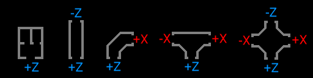

# How to Use?
## Parameters
There are some parameters:

- `Seed`: the seed for random generator. The map generation is dependent on this value. -1 means random seed.
- `Rooms`: See Rooms chapter.
- `Zone size`: The size for a "zone" - a square, which contains rooms.
- `Map Size X and Y`: Amount of "zones" (not rooms). Can be rectangular, unlike a zone.
  - ⚠ X and Y are beginning from 0, not 1!
  - ⚠ The amount of zones in Rooms variable MUST be equal or more than X ` Y (or (X + 1) ` (Y + 1), if you count zones from 1)
- `Grid size`: The size of a room model (X and Z dimensions). For SCP-CB remake, you should use 20.48, the default value.
- `Large rooms`: Usually, the room size should be equal to `Grid size` variable. But what about bigger rooms? Since v.6.1, the large rooms (max size - 2 * 3 cells for endrooms) are supported too, althrough limited to `Zone_size` / 6
- `Room amount`: Amount of endrooms. Calculated as `Zone_size` * `Room_amount`. Maybe not accurate, if `Better zone generation` not enabled.
- `Enable door generation`: Generates doors between rooms. Can use different doors, since v.5.1, this also affect checkpoint rooms since v.8.0
- `Checkpoints enabled`: Adds checkpoints to each zone (and **decrease** available room spawn). Added in v.8.0
  - ⚠ The checkpoint room behaves differently, than SCP-CB checkpoints, the "checkpoint" in this mapgen have 2 rooms (like HCZ-EZ checkpoint in SCP: Secret Lab.), not one (as in SCP-CB). .
- `Better zone generation`: Enable endroom checking (there are situations, where the last room to generate is in a existing hallway). May have a little generation time cost. Available since v. 7.1

## Rooms
`Rooms` parameter is the specific `Resource` type, where contains the room of the zones:
- `Room1` is an endroom,
- `Room2` is a hallway,
- `Room2C` is a curve,
- `Room3` is a T-shaped room,
- `Room4` is a X-shaped room
- `Single` means that room may not duplicate.
- `Checkpoint hallway` means that the rooms will be used as checkpoints (if checkpoints are enabled). Added in v.8.0
- `Large` mean large room (see Parameters chapter)
- `Door frames` is a `PackedScene` array, containing all variations of doors.
- `Checkpoint door frames` is like door frames, but only for checkpoint (if checkpoints are enabled). Added in v.8.0

All parameters in this resource (called `MapGenZone`) (except `Door frames`) are also `Resources` - `MapGenRoom` which also have some parameters:
- `Name`,
- `Prefab` (you need to put room scene there),
- `Icon 0, 90, 180, 270 degrees` - see example resources to see the right align of the room. (available since 7.0)
- `Spawn chance` - set the spawn chance of the room.
  - ⚠ The spawn chance is *ignored* by `Single` and `Large` room types, also the large endroom **always** spawns if the `Large room` is enabled and `Large` rooms count in `MapGenZone` > 1.
- `Door type` - The default value, -1 means, that any door frame (see MapGenZone doorframes) can be used. Otherwise, only specific door frame can be used with this room (similar mechanic used in SCP: Secret Lab. since 14.0). Added in MapGen v.8.0

## Prepare a room for map generation.
In Godot editor, make sure, that the exits of rooms faces the axis, seen in this picture:
